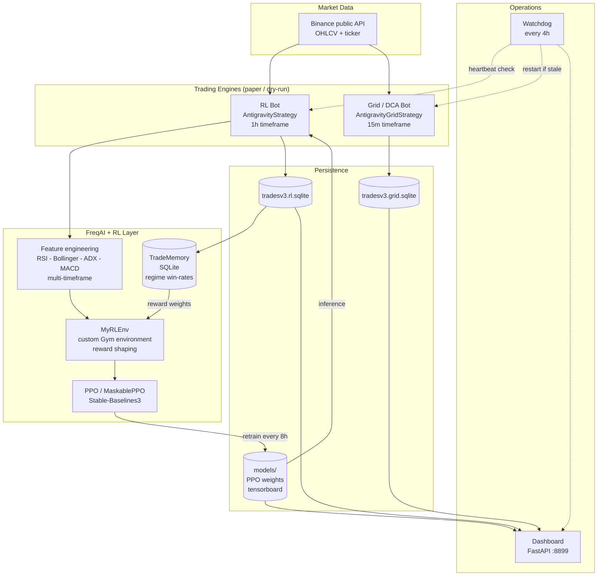
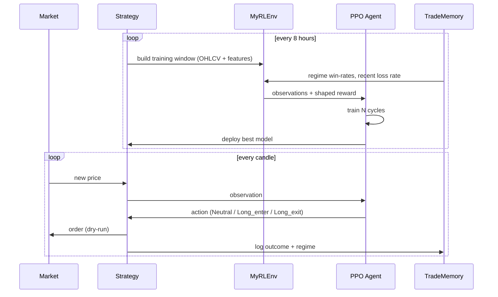
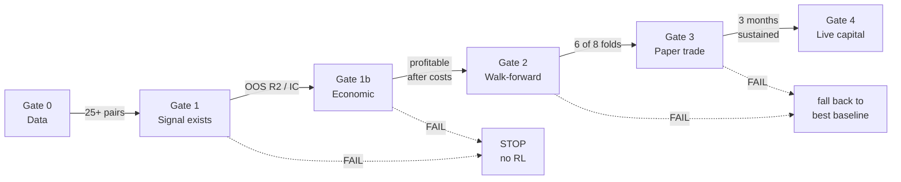

# Qoherenz Trade Bot

Reinforcement-learning crypto trading research platform built on [Freqtrade](https://www.freqtrade.io/) 2025.6 + FreqAI + Stable-Baselines3.

Two paper-trading bots (an RL agent and a rule-based Grid/DCA bot) run against Binance spot data, with a live monitoring dashboard and a rigorous, gate-based research pipeline for validating whether a trading signal actually exists before committing to a model.

> **Status: research complete, strategy NOT deployed to live capital.**
> The validation pipeline returned a **negative result** — see [Research Findings](#research-findings). This repository is published as a reproducible record of the methodology and that finding.

---

## Architecture



### The RL learning loop



---

## Components

| Path | Purpose |
|---|---|
| `user_data/strategies/AntigravityStrategy.py` | RL strategy — entry/exit gating, feature engineering for FreqAI |
| `user_data/strategies/AntigravityGridStrategy.py` | Rule-based 3-mode Grid/DCA strategy (no ML) |
| `user_data/freqaimodels/AntigravityRLModel.py` | Custom PPO model + `MyRLEnv` with reward shaping |
| `user_data/freqaimodels/AntigravityRLModelV3.py` | V3 — monotonic reward, action masking, terminated/truncated split |
| `user_data/freqaimodels/trade_memory.py` | SQLite store of trade outcomes by market regime |
| `ui/dashboard.py` | FastAPI monitoring dashboard (port 8899) |
| `watchdog.ps1` | Heartbeat monitor; restarts hung/zombie processes |
| `research/` | **Validation pipeline — the core deliverable** |

---

## Research Findings

The central question: *does this system actually learn to trade profitably?*

A staged validation pipeline was built with **pre-registered pass thresholds**, so that failure is detectable rather than rationalisable.

### 1. The RL layer showed no measurable learning

Across **286 live retrain cycles**, training reward had no statistically significant trend:

| Metric | Result |
|---|---|
| `ep_rew_mean` trend | r = +0.055, **p = 0.765** |
| `eval/mean_reward` trend | r = -0.040, **p = 0.829** |

Reward oscillated with a standard deviation (236) far exceeding any drift — the signature of noise, not learning.

### 2. Three genuine engineering defects were found and fixed

| Defect | Impact | Fix |
|---|---|---|
| **Reward inversion** | A -2.0% loss scored **+0.30** while a +1.0% win scored **-0.10**. The agent was paid to lose and farmed the exploit — reward climbed to +19 while the account lost 23%. | Single monotonic reward function, strictly increasing in PnL |
| **Dead action space** | Short actions unusable on spot but never masked — 16% of actions wasted, 23% invalid | Switched to `MaskablePPO`; Short/invalid dropped to **0.0%** |
| **Curse of dimensionality** | 433 features on 590 samples = **1.36:1** | Dropped redundant correlated pair, reduced lags → **153 features / 1813 samples = 11.9:1** |

All three fixes verified working. **None produced a profitable strategy.**

### 3. Exit geometry made profit arithmetically impossible

The ROI ladder decayed to 0.5% while the stoploss risked 3.0%:

| | Value |
|---|---|
| Win rate | 70.2% |
| Average win | +0.82% |
| Average loss | -1.94% |
| Payoff ratio | 0.42 : 1 |
| **Break-even win rate required** | **70.3%** |

The strategy sat exactly on its break-even point — 47 trades netted **-0.04 USDT**. Not unlucky; structurally incapable of profit.

### 4. Direction is unpredictable; volatility is not

ETH/USDT 1h, 23,175 candles:

| Target | Out-of-sample R-squared |
|---|---|
| Next-hour **return** (direction) | **-0.0066** — worse than guessing the mean |
| Next-hour **volatility** | **+0.108** |

Volatility clustering is real and exploitable for *risk control*. It does not generate alpha: vol-targeted position sizing was tested and **reduced** Sharpe by 0.14, because scaling exposure to a zero-drift asset yields zero.

### 5. Gate results on a 29-pair universe

| Gate | Test | Threshold | Result |
|---|---|---|---|
| 0 | Data foundation | at least 25 pairs | **PASS** — 29 pairs, 31,945 hourly candles each |
| 1 | Signal exists | OOS R-squared > 0.02 | **FAIL** — 0.0028 (IC = +0.064, p = 2e-11) |
| 1b | Economic viability | positive after costs | **FAIL** — no configuration profitable |
| 2 | Walk-forward | beat benchmarks in 6/8 folds | **FAIL** — 4/6, and **lost money in all six folds** |

The cross-sectional signal is *statistically real* (IC 0.064) but too weak to survive 0.2% round-trip transaction costs.

### Conclusion

> Classical technical-analysis features on liquid crypto pairs do not contain enough predictive signal to fund a profitable systematic strategy after costs. The RL machinery works correctly; there was no edge for it to exploit.

The pipeline stopped the project at the correct point — **before** deploying capital.

---

## Setup

```bash
# 1. Install
python -m venv venv
venv/Scripts/activate        # Windows
pip install -r requirements.txt

# 2. Configure (never commit real credentials)
cp .env.example .env
#   set FREQTRADE_JWT_SECRET / FREQTRADE_API_USER / FREQTRADE_API_PASSWORD

# 3. Download market data
freqtrade download-data --config config/config_universe.json \
  --timeframes 1h 4h 1d --timerange 20230101-

# 4. Run the validation pipeline BEFORE trusting any model
python research/signal_survey.py         # where is the signal?
python research/gate1_signal_test.py     # does predictive signal exist?
python research/gate1b_economic_test.py  # does it survive costs?
python research/gate2_walkforward.py     # does it hold across regimes?

# 5. Paper trade (dry-run only)
./run_dryrun.bat     # RL bot
./run_grid.bat       # Grid bot
./run_ui.bat         # dashboard at http://localhost:8899
```

### Requirements
- Python 3.10+, Windows (PowerShell scripts) or adapt for Linux
- Freqtrade 2025.6, Stable-Baselines3 2.8, sb3-contrib 2.8, PyTorch 2.6 (CUDA optional)
- TA-Lib C library

---

## Validation methodology

The gate system is the reusable part of this project. Each stage has a numeric threshold fixed *before* the test runs, and a defined fallback on failure.



**Rule:** a threshold may not be relaxed after seeing results. If a threshold turns out to be miscalibrated, that must be stated explicitly and re-validated against a *harder* independent test — which is what happened at Gate 1 here. The R-squared bar was too strict for return prediction, so the economic test at Gate 1b became the arbiter, and it failed.

---

## Safety

- All trading is **dry-run / paper only**. No live keys, no real capital.
- API keys are empty strings; secrets are environment placeholders.
- `.gitignore` excludes market data, model weights, trade databases, logs, and the virtualenv.
- Nothing in this repository constitutes financial advice.

## License

MIT
